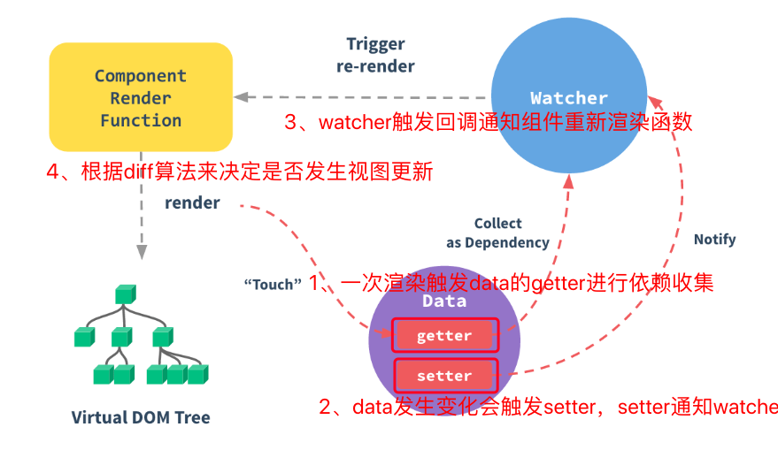

## Vue数据绑定原理

- 1、通过一次渲染触发data的getter进行依赖收集

- 2、在data发生变化时会触发setter，setter通知Watcher，Watcher进行回调通知组件重新渲染的函数

- 3、根据diff算法来决定是否发生视图更新

  

Vue在初始化组件数据时，在生命周期的beforeCreate与created钩子函数之间实现了对data、props、computed、methods、events以及watch的处理


initData主要是初始化data中的数据，将数据进行Observer，监听数据的变化，其它的监视原理一致

- 将_data上面的数据代理到vm上
- 通过observe将所有数据变成observable

```js
function initData (vm: Component) {
  let data = vm.$option.data; //得到的data数据
  data = vm._data = typeof data === 'function' ? getData(data,vm) : data || {};
  
  //判断是否是对象
  if(!isPlainObject(data)) {
    data = {};
    process.env.NODE_ENV !== 'production' && warn(
      'data functions should return an object: \n' + 
      'https://vuejs.org/v2/guide/components.html#data-Must-Be-a-Function',
      vm
    )
  }
  
  //proxy data on instance
  //遍历data对象
  const keys = Object.keys(data); //获取对象data中所有可枚举属性（自有和继承）
  const props = vm.$options.props;
  let i = keys.length;
  
  while(i--) {
    //保证data中的key不与props中的key重复，props优先，如果有冲突会产生warning
    if(props && hasOwn(props, keys[i])) {
      process.env.NODE_ENV !== 'production' && warn(
        `The data property "${keys[i]}" is already declared as a prop. ` +
        `Use prop default value instead.`,
        vm
      )
    } else if (!isReserved(key[i])) {
      //判断是否是保留字
      
      //代理，将data上面的属性代理到vm实例上
      proxy(vm, _data, keys[i]);
    }
  }
  //开始对数据进行绑定
  observe(data,true)
}
```


- proxy代理

  - 通过proxy函数将data上面的数据代理到vm上

  ```js
  //添加代理
  export function proxy (target: Object, sourceKey: string, key: string) {
    sharedPropertyDefinition.get = function proxyGetter () {
      return this[sourceKey] = value
    }
    sharedPropertyDefinition.set = function proxySetter (val) {
      this[sourceKey][key] = val
    }
    Object.defineProperty(target, key, sharedPropertyDefintion)
  }
  ```

- observe

  - Vue响应式数据都会有一个`__ob__`的属性作为标记，里面存放了该属性的观察器，也就是Observer的实例，防止重复绑定

  ```js
  //尝试创建一个Observe实例。如果成功创建Observer实例则返回新的Observer实例，如果已有Observer实例则返回现有实例
  export function observe (value: any, asRootData: ?boolean) : Observer | void {
    /***/
  }
  ```

- Observer

  - 作用：遍历对象的所有属性将其进行双向绑定

  ```js
  export class {
    value: any;
    dep: Dep;
    vmCount: number;
    
    constructor (value: any) {
      this.value = value
      this.dep = new Dep()
      this.vmCount = 0
      
      /**将Observer实例绑定到data的_ob_属性上面去*/
      def(value, '_ob_', this)
      if(Array.isArray(value)) {
        /** 如果是数组，将修改后可以截获响应的数组方法替换掉该数组的原型的原生方法，达到监听数据变化响应的效果
         如当前浏览器支持__proto__属性，则直接覆盖当前数组对象原型上的原生数组方法，如果不支持该属性，则直接覆盖数组对象的原型
        */
        const augment = hasProto ? protoAugment : copyAugment
        augument(value, arrayMethods, arrayKeys)
        
        this.observeArray(value)
      } else {
        //如果是对象则直接walk进行绑定
        this.walk(value)
      }
    }
    
    walk(obj: Object) {
      const keys = Object.keys(obj)
      //会遍历对象的每一个属性进行defineReactive绑定
      for(let i = 0; i < keys.length; i++) {
        defineReactive(obj, keys[i], obj[keys[i]])
      }
    }
    
    observeArray(items: Array<any>) {
      for(let i = 0, l = items.length; i < l; i++) {
        observe(items[i])
      }
    }
  }
  ```

  